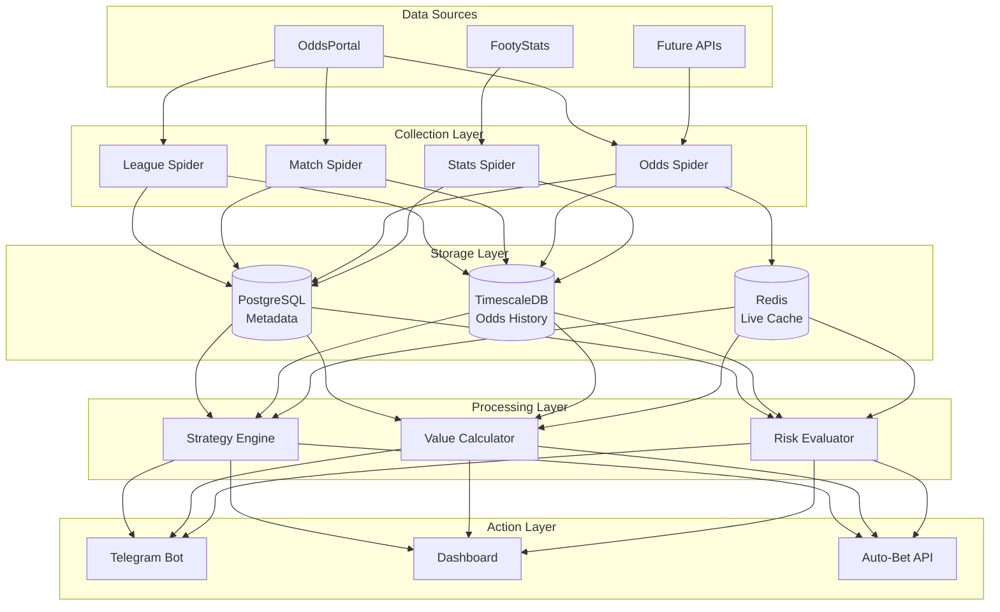

# Value Betting Platform Documentation

## Project Overview
A scalable, multi-strategy sports betting platform designed to identify profitable betting opportunities through advanced data engineering and data science. The system supports both top-down strategies (like arbitrage) and bottom-up approaches (value discovery through historical analysis and alpha generation).

## Business Context
- **Purpose**: Flexible betting platform supporting multiple strategies
- **Strategy Types**: 
  - **Top-down**: Arbitrage betting, sure bets across bookmakers
  - **Bottom-up**: Value discovery using historical data, alpha generation, market inefficiency exploitation
- **Betting Modes**: Pre-match (current focus) and live betting (future)
- **Initial Sport**: Soccer/football (expandable architecture)
- **Deployment**: Arvan Cloud VPS (Iran-based infrastructure)

## Core Capabilities & Requirements

### Performance Targets
- **Concurrent Matches**: 100 matches simultaneously
- **Value Calculation Speed**: <30 seconds per opportunity
- **Data Collection**: Real-time and historical odds
- **Storage**: Complete historical records + on-demand snapshots

### Strategy Support Framework
```python
# Strategy Interface (conceptual)
class BettingStrategy:
    def identify_opportunity(self, odds_data, historical_data=None)
    def calculate_value(self, opportunity)
    def recommend_stake(self, opportunity, bankroll)
    def assess_risk(self, opportunity)
```

**Supported Strategies** (modular design):
1. **Arbitrage**: Cross-bookmaker opportunity detection
2. **Value Betting**: Expected value calculations using true probability estimates
3. **Alpha Strategies**: Custom indicators from historical patterns
4. **Middle Betting**: Line movement exploitation
5. **Closing Line Value**: Beat the closing line consistently

## Technical Architecture

### Core Technologies
- **Scraping Framework**: Scrapy 2.11.2
- **Orchestration**: Apache Airflow 2.10.5 (Celery Executor)
- **Containerization**: Docker & Docker Compose
- **Database**: PostgreSQL (metadata) + TimescaleDB (time-series odds data) [planned]
- **Message Queue**: Redis (Celery broker + real-time cache)
- **Calculation Engine**: NumPy/Pandas for vectorized operations
- **Language**: Python 3.x
- **CI/CD**: GitLab (planned)
- **Monitoring**: Grafana + Prometheus (planned)

### Data Architecture



## Project Structure

```
.
├── scrapers/
│   └── odds_scraper/
│       ├── odds_scraper/
│       │   ├── spiders/
│       │   │   ├── odds_portal/       # OddsPortal specific spiders
│       │   │   ├── footystats/        # FootyStats spiders
│       │   │   └── base/              # Base spider classes
│       │   ├── items/                 # Data models
│       │   ├── pipelines/             # Data processing
│       │   └── strategies/            # Betting strategies [NEW]
├── airflow/
│   ├── dags/
│   │   ├── odds_collection/           # Odds scraping DAGs
│   │   ├── value_calculation/         # Strategy execution DAGs
│   │   └── alerting/                  # Notification DAGs
├── analytics/                          # [NEW]
│   ├── strategies/                    # Strategy implementations
│   ├── backtesting/                   # Historical strategy testing
│   └── alpha_research/                # Alpha discovery notebooks
├── notifications/                      # [NEW]
│   ├── telegram/                      # Telegram bot
│   └── dashboard/                     # Future web dashboard
├── docker/
├── docker-compose.yml
└── requirements.txt
```

## Data Flow Pipeline

### 1. Discovery Phase
```
League Discovery → Season Extraction → Match Identification
```

### 2. Collection Phase
```
Match Metadata → Odds Snapshots → Continuous Updates
```

### 3. Analysis Phase
```
Historical Analysis → Pattern Recognition → Strategy Application
```

### 4. Action Phase
```
Opportunity Detection → Risk Assessment → Alert/Bet Placement
```

## Spider Architecture (OddsPortal)

### Data Collection Workflow
```python
# Pseudo-code for complete workflow
async def collect_match_data(match_url):
    # Step 1: Get match metadata
    match_data = await match_spider.scrape(match_url)
    
    # Step 2: Extract odds parameters
    params = {
        'match_id': match_data.match_id,
        'xhashf': match_data.xhashf,
        'sport_id': match_data.sport_id
    }
    
    # Step 3: Collect odds for all markets
    for bet_type in CONFIGURED_BET_TYPES:
        odds = await odds_spider.scrape(params, bet_type)
        store_odds_snapshot(odds)
    
    # Step 4: Schedule updates based on match timing
    schedule_updates(match_data.timestamp)
```

### Update Frequency Strategy
```python
def calculate_update_frequency(match_timestamp):
    time_until_match = match_timestamp - now()
    
    if time_until_match < timedelta(hours=1):
        return "*/2 * * * *"  # Every 2 minutes
    elif time_until_match < timedelta(days=1):
        return "*/10 * * * *"  # Every 10 minutes
    elif time_until_match < timedelta(days=7):
        return "0 * * * *"     # Every hour
    else:
        return "0 */6 * * *"   # Every 6 hours
```

## Data Schema

### Core Entities
```sql
-- Sports and Competitions
CREATE TABLE sports (
    sport_id VARCHAR PRIMARY KEY,
    sport_name VARCHAR NOT NULL
);

CREATE TABLE leagues (
    league_id VARCHAR PRIMARY KEY,
    league_name VARCHAR NOT NULL,
    sport_id VARCHAR REFERENCES sports(sport_id),
    country VARCHAR,
    tier INTEGER
);

-- Matches
CREATE TABLE matches (
    match_id VARCHAR PRIMARY KEY,
    league_id VARCHAR REFERENCES leagues(league_id),
    home_team VARCHAR NOT NULL,
    away_team VARCHAR NOT NULL,
    match_timestamp TIMESTAMP,
    status VARCHAR  -- scheduled, live, finished, postponed
);

-- Odds Snapshots (TimescaleDB hypertable)
CREATE TABLE odds_snapshots (
    match_id VARCHAR REFERENCES matches(match_id),
    bookmaker_id INTEGER,
    market_type VARCHAR,  -- 1X2, O/U, AH, etc.
    selection VARCHAR,    -- home, draw, away, over_2.5, etc.
    odds DECIMAL(6,3),
    volume INTEGER,
    collected_at TIMESTAMP,
    is_closing BOOLEAN DEFAULT FALSE
);

-- Strategy Opportunities
CREATE TABLE opportunities (
    opportunity_id SERIAL PRIMARY KEY,
    strategy_type VARCHAR,  -- arbitrage, value, alpha_1, etc.
    match_id VARCHAR REFERENCES matches(match_id),
    expected_value DECIMAL(8,4),
    confidence DECIMAL(5,2),
    stake_recommendation DECIMAL(10,2),
    identified_at TIMESTAMP,
    expires_at TIMESTAMP,
    status VARCHAR  -- pending, placed, won, lost, expired
);
```

## Strategy Implementation Framework

### Base Strategy Class
```python
from abc import ABC, abstractmethod
from typing import Dict, List, Optional, Tuple

class BaseStrategy(ABC):
    """Base class for all betting strategies"""
    
    @abstractmethod
    def identify_opportunities(
        self, 
        odds_data: Dict,
        historical_data: Optional[pd.DataFrame] = None
    ) -> List[Opportunity]:
        """Identify betting opportunities"""
        pass
    
    @abstractmethod
    def calculate_expected_value(
        self, 
        opportunity: Opportunity
    ) -> float:
        """Calculate expected value of opportunity"""
        pass
    
    @abstractmethod
    def calculate_stake(
        self, 
        opportunity: Opportunity,
        bankroll: float,
        risk_profile: str = 'conservative'
    ) -> float:
        """Calculate recommended stake using Kelly Criterion or fixed"""
        pass
```

### Arbitrage Strategy Example
```python
class ArbitrageStrategy(BaseStrategy):
    """Find arbitrage opportunities across bookmakers"""
    
    def identify_opportunities(self, odds_data, historical_data=None):
        opportunities = []
        
        for match in odds_data:
            # Check 1X2 market
            best_home = max(match['1X2']['home'].items(), key=lambda x: x[1])
            best_draw = max(match['1X2']['draw'].items(), key=lambda x: x[1])
            best_away = max(match['1X2']['away'].items(), key=lambda x: x[1])
            
            # Calculate arbitrage percentage
            arb_percentage = (1/best_home[1] + 1/best_draw[1] + 1/best_away[1])
            
            if arb_percentage < 1.0:  # Arbitrage exists
                margin = (1.0 - arb_percentage) * 100
                opportunities.append(
                    Opportunity(
                        match_id=match['id'],
                        strategy='arbitrage',
                        margin=margin,
                        odds={
                            'home': best_home,
                            'draw': best_draw,
                            'away': best_away
                        }
                    )
                )
        
        return opportunities
```

## Alert System

### Telegram Bot Integration
```python
# Notification format
ALERT_TEMPLATE = """
🎯 *{strategy_name} Opportunity*

⚽ *Match*: {home_team} vs {away_team}
📅 *Time*: {match_time}
🏆 *League*: {league}

💰 *Expected Value*: {ev:.2f}%
📊 *Confidence*: {confidence:.1f}%
💵 *Recommended Stake*: ${stake:.2f}

📈 *Details*:
{opportunity_details}

⏰ *Expires*: {expiry_time}

[View Dashboard]({dashboard_link})
"""
```

### Alert Priority Levels
1. **🔴 Critical**: Arbitrage opportunities >2% margin
2. **🟠 High**: Value bets >5% EV
3. **🟡 Medium**: Closing line value opportunities
4. **🟢 Low**: Alpha signals, pattern alerts

## Proxy & Access Management

### Proxy Strategy (To Be Implemented)
```python
PROXY_CONFIG = {
    'rotation_strategy': 'round_robin',  # or 'random', 'geographic'
    'retry_on_block': True,
    'max_retries': 3,
    'providers': [
        # To be configured with actual providers
    ],
    'geographic_targets': [
        'UK',  # For UK-specific odds
        'US',  # For US bookmakers
        'EU',  # General European odds
    ]
}
```

### VPN Fallback
- Use VPN as backup when proxies fail
- Maintain list of betting-friendly VPN servers
- Automatic switching on detection of blocks

## Monitoring & Alerting

### Key Metrics to Track
```yaml
scraping_metrics:
  - spider_success_rate    # Target: >95%
  - data_freshness         # Target: <5 minutes for live
  - coverage_percentage    # Target: >90% of bookmakers
  
strategy_metrics:
  - opportunities_per_hour
  - average_expected_value
  - win_rate
  - roi
  
system_metrics:
  - calculation_latency    # Target: <30 seconds
  - database_query_time
  - alert_delivery_time
```

### Health Checks
```python
# Automated health check DAG
health_checks = {
    'data_freshness': check_last_scrape_time,
    'spider_health': check_spider_errors,
    'strategy_performance': check_recent_opportunities,
    'database_health': check_db_connections,
    'alert_system': check_telegram_bot_status
}
```

## Development Phases

### Phase 1: Foundation (Current)
- [x] Basic Scrapy infrastructure
- [x] OddsPortal match & odds spiders
- [x] Docker containerization
- [ ] PostgreSQL schema implementation
- [ ] Basic Airflow DAGs

### Phase 2: Core Functionality (Q1 2025)
- [ ] Complete spider suite for OddsPortal
- [ ] Telegram bot implementation
- [ ] Arbitrage strategy implementation
- [ ] Basic monitoring dashboard
- [ ] Proxy rotation system

### Phase 3: Advanced Strategies (Q2 2025)
- [ ] Historical data analysis pipeline
- [ ] Alpha discovery framework
- [ ] Value betting algorithms
- [ ] Backtesting system
- [ ] Advanced risk management

### Phase 4: Scale & Optimize (Q3 2025)
- [ ] Live betting support
- [ ] Multi-sport expansion
- [ ] Machine learning models
- [ ] Automated betting API integration
- [ ] Professional dashboard

## Quick Start Guide

```bash
# 1. Clone and setup
git clone [repository]
cd value-betting-platform
cp .env.example .env

# 2. Configure environment
# Edit .env with your settings

# 3. Start infrastructure
docker-compose up -d

# 4. Initialize database
docker-compose exec airflow-webserver airflow db init

# 5. Test spider
docker-compose exec airflow-worker scrapy crawl oddsportal_match_spider \
  -a match_url="https://www.oddsportal.com/football/[match-url]/"

# 6. Access Airflow UI
# http://localhost:8080 (airflow/airflow)

# 7. Configure Telegram bot
# Add bot token to .env
# Start notification service
```

## Common Operations

### Collect Historical Data
```bash
# Scrape historical season
scrapy crawl oddsportal_season_spider \
  -a league_id="premier-league" \
  -a season_id="2023-2024" \
  -a mode="results"
```

### Manual Opportunity Check
```python
from analytics.strategies import ArbitrageStrategy
from scrapers.utils import get_current_odds

odds = get_current_odds(match_ids=['match1', 'match2'])
strategy = ArbitrageStrategy()
opportunities = strategy.identify_opportunities(odds)

for opp in opportunities:
    print(f"Found: {opp.match_id} - EV: {opp.expected_value}%")
```

### Backtest Strategy
```python
from analytics.backtesting import Backtester
from analytics.strategies import ValueBettingStrategy

backtester = Backtester(
    strategy=ValueBettingStrategy(),
    start_date='2023-01-01',
    end_date='2023-12-31',
    initial_bankroll=1000
)

results = backtester.run()
print(f"ROI: {results.roi}%, Win Rate: {results.win_rate}%")
```

## Error Handling & Recovery

### Common Issues & Solutions

| Issue | Symptoms | Solution |
|-------|----------|----------|
| Rate Limiting | 429 errors, slow responses | Increase delays, use proxies |
| Decryption Failure | Empty odds data | Check encryption keys, update parser |
| Stale Data | Old timestamps | Check spider scheduling, increase frequency |
| Memory Issues | Container crashes | Batch processing, increase resources |
| Network Timeout | Connection errors | Retry logic, timeout adjustments |

### Recovery Procedures
```python
# Automatic recovery in spiders
class RobustSpider(scrapy.Spider):
    custom_settings = {
        'RETRY_TIMES': 3,
        'RETRY_HTTP_CODES': [500, 502, 503, 504, 408, 429],
        'DOWNLOAD_TIMEOUT': 30,
        'AUTOTHROTTLE_ENABLED': True,
    }
    
    def errback_httpbin(self, failure):
        if failure.check(HttpError):
            # Log and potentially switch proxy
            self.logger.error(f'HttpError on {failure.request.url}')
            self.proxy_manager.mark_failed(failure.request.proxy)
```

## Security Considerations

### Data Protection
- Encrypt sensitive configuration (API keys, passwords)
- Use environment variables for all credentials
- Implement database access controls
- Regular security audits of dependencies

### Operational Security
- VPN/Proxy for all external requests
- Rate limiting to avoid detection
- User-agent rotation
- Request header randomization

## Performance Optimization

### Database Optimization
```sql
-- Key indexes for performance
CREATE INDEX idx_odds_match_time ON odds_snapshots(match_id, collected_at DESC);
CREATE INDEX idx_opportunities_status ON opportunities(status, expires_at);
CREATE INDEX idx_matches_timestamp ON matches(match_timestamp);

-- Partitioning for TimescaleDB
SELECT create_hypertable('odds_snapshots', 'collected_at');
```

### Caching Strategy
```python
REDIS_CACHE_CONFIG = {
    'live_odds_ttl': 60,      # 1 minute for live odds
    'match_metadata_ttl': 3600,  # 1 hour for match data
    'historical_stats_ttl': 86400,  # 1 day for historical
}
```

## Glossary

**Alpha**: A strategy or signal that provides returns above market average
**Arbitrage**: Risk-free profit from price differences across bookmakers
**Closing Line Value (CLV)**: Beating the final odds before match start
**Edge**: Expected profit margin over the bookmaker
**Expected Value (EV)**: Average profit/loss of a bet if repeated many times
**Kelly Criterion**: Optimal bet sizing formula based on edge and odds
**Lay Betting**: Betting against an outcome (acting as bookmaker)
**Middle**: Betting both sides with possibility of winning both
**ROI**: Return on Investment (profit/initial bankroll)
**Value Bet**: Bet where true probability exceeds implied probability
**Vig/Juice**: Bookmaker's margin built into odds

## Support & Troubleshooting

### Debug Mode
```bash
# Enable debug logging
export SCRAPY_DEBUG=1
scrapy crawl spider_name -L DEBUG

# Check Airflow logs
docker-compose logs airflow-scheduler
docker-compose exec airflow-worker tail -f /opt/airflow/logs/[dag_id]/[task_id]/[execution_date]/1.log
```

### Contact & Resources
- Documentation: This file
- Issue Tracking: GitLab Issues
- Monitoring: Grafana Dashboard (when deployed)
- Logs: Airflow UI → Browse → Logs

## Notes for Claude Code

### When Working on This Project:
1. **Respect the modular architecture** - Keep strategies, spiders, and analysis separate
2. **Test incrementally** - Always test with single matches before bulk operations
3. **Preserve backward compatibility** - Don't break existing data structures
4. **Use type hints** - Especially for strategy interfaces
5. **Document calculations** - Comment all EV and probability calculations
6. **Handle errors gracefully** - Network operations will fail, plan for it
7. **Optimize for clarity over cleverness** - Maintainability is key
8. **Consider memory usage** - We're processing lots of time-series data
9. **Maintain audit trail** - Log all opportunities and decisions
10. **Test strategies historically** - Always backtest before live deployment

### Priority Order for Development:
1. Complete data collection pipeline
2. Implement basic arbitrage detection
3. Set up Telegram notifications
4. Add historical data storage
5. Build backtesting framework
6. Develop custom alpha strategies