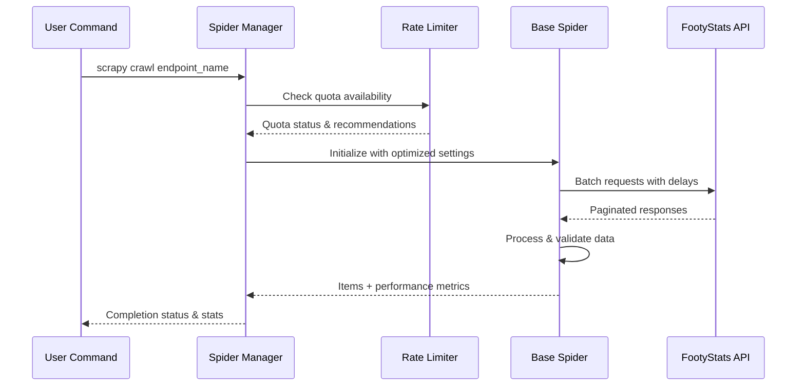
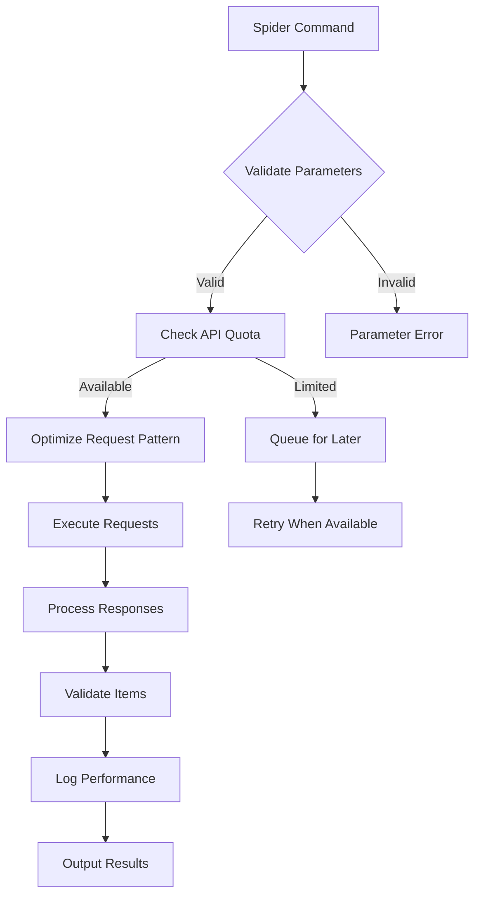
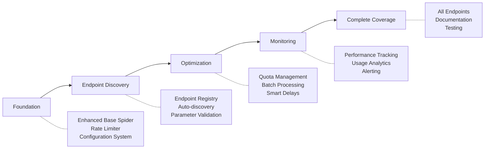
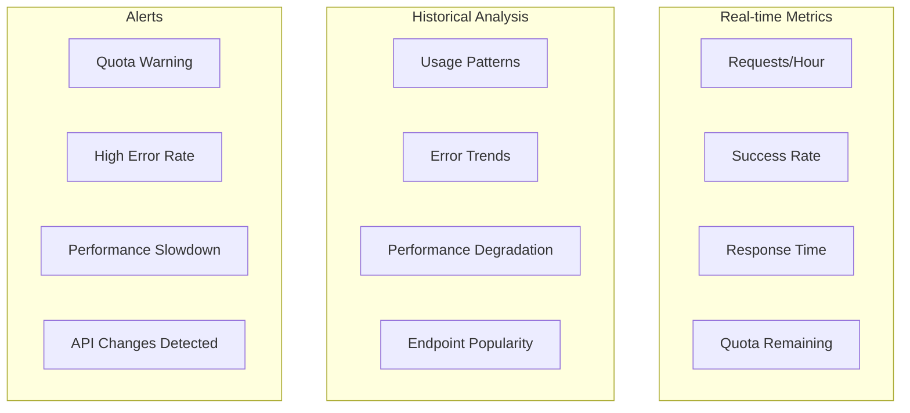

# FootyStats Efficient Endpoint Crawling - PRD

## Executive Summary

### Problem Statement
The current FootyStats scraping infrastructure has 10+ individual spider implementations with inconsistent patterns, suboptimal rate limit usage (1800 req/hour), and no centralized endpoint management. While the foundation is solid, there's opportunity to improve efficiency, maintainability, and coverage across all available FootyStats API endpoints.

### Solution Overview
Enhance the existing FootyStats spider architecture with:
- **Unified endpoint discovery and management system**
- **Optimized rate limiting and batch processing**
- **Comprehensive endpoint coverage with standardized patterns**
- **Enhanced error handling and retry mechanisms**
- **Performance monitoring and API quota optimization**

### Success Metrics
- **Coverage**: 100% of FootyStats API endpoints accessible via spiders
- **Efficiency**: <90% of 1800 req/hour quota utilization for full data collection
- **Reliability**: >95% success rate for API requests
- **Maintainability**: Single configuration system for all endpoints
- **Performance**: <30 seconds average response time per spider

## User Stories & Scenarios

### Primary User Flow


### User Stories

1. **As a data analyst**, I want to run any FootyStats endpoint spider with consistent command patterns so that I can collect data efficiently
   - Acceptance Criteria:
     - [ ] All spiders follow same parameter naming conventions
     - [ ] Consistent error messages and logging
     - [ ] Standardized output formats
   - Edge Cases:
     - Invalid API keys
     - Network timeouts
     - Rate limit exceeded

2. **As a system administrator**, I want to monitor API quota usage across all spiders so that I can optimize resource allocation
   - Acceptance Criteria:
     - [ ] Real-time quota tracking
     - [ ] Usage statistics per endpoint
     - [ ] Automatic rate limiting adjustments
   - Edge Cases:
     - Quota near exhaustion
     - Multiple concurrent spiders

3. **As a developer**, I want to add new FootyStats endpoints easily so that I can extend coverage without code duplication
   - Acceptance Criteria:
     - [ ] Configuration-driven endpoint definition
     - [ ] Automatic parameter validation
     - [ ] Inherited error handling
   - Edge Cases:
     - New endpoint with different response structure
     - Deprecated endpoints

## System Architecture

### High-Level Architecture
```mermaid
graph TB
    subgraph "Spider Management"
        SM[Spider Manager]
        EC[Endpoint Coordinator]
        RL[Rate Limiter]
    end
    
    subgraph "Current Spiders"
        BS[Base Spider]
        CS1[Country Spider]
        CS2[League Spider]
        CS3[Match Spider]
        CSN[... 10+ Spiders]
    end
    
    subgraph "Enhanced Components"
        ED[Endpoint Discovery]
        OP[Optimization Engine]
        MP[Monitoring & Performance]
    end
    
    subgraph "FootyStats API"
        API[api.football-data-api.com]
        EP1[/countries]
        EP2[/leagues] 
        EP3[/matches]
        EPN[... all endpoints]
    end
    
    SM --> EC
    EC --> RL
    RL --> BS
    BS --> CS1 & CS2 & CS3 & CSN
    
    ED --> SM
    OP --> RL
    MP --> SM
    
    CS1 & CS2 & CS3 & CSN --> EP1 & EP2 & EP3 & EPN
    EP1 & EP2 & EP3 & EPN --> API
```

### Component Breakdown

- **Enhanced Base Spider**: Extended with quota management, optimized batching, enhanced retry logic
- **Endpoint Discovery Service**: Auto-discovers available endpoints and their parameters
- **Rate Limiter**: Intelligent quota distribution across concurrent spiders
- **Optimization Engine**: Analyzes usage patterns and suggests improvements
- **Monitoring Service**: Tracks performance, success rates, and quota usage

### Data Models

- **Endpoint Configuration**: endpoint_name, required_params, optional_params, rate_limits, response_structure
- **Usage Statistics**: timestamp, endpoint, requests_made, success_rate, quota_consumed, response_time
- **Spider Metadata**: spider_name, last_run, total_items, error_count, performance_metrics

## Technical Specifications

### API Request Optimization


### Enhanced Endpoints

#### New Endpoint Pattern
```python
# Configuration-driven endpoint definition
FOOTYSTATS_ENDPOINTS = {
    "match-goals": {
        "required_params": ["match_id"],
        "optional_params": ["page", "max_per_page"],
        "rate_limit": 0.5,  # requests per second
        "response_type": "list",
        "item_class": "MatchGoalsItem"
    },
    "team-fixtures": {
        "required_params": ["team_id"],
        "optional_params": ["season_id", "date_from", "date_to"],
        "rate_limit": 0.3,
        "response_type": "list",
        "item_class": "TeamFixturesItem"
    }
    # ... all endpoints
}
```

#### Data Flow


## Implementation Strategy

### Development Phases


### Implementation Priority

1. **Foundation Enhancement** (Week 1)
   - Extend FootyStatsBaseSpider with quota management
   - Implement centralized rate limiting
   - Create endpoint configuration system

2. **Endpoint Discovery** (Week 1)
   - Auto-discover available FootyStats endpoints
   - Create dynamic spider generation
   - Implement parameter validation

3. **Optimization Features** (Week 2)
   - Intelligent quota distribution
   - Batch request optimization
   - Adaptive delay mechanisms

4. **Monitoring & Analytics** (Week 2)
   - Performance tracking dashboard
   - Quota usage monitoring
   - Error pattern analysis

5. **Complete Coverage** (Week 3)
   - Implement all missing endpoints
   - Comprehensive testing
   - Documentation and examples

## Challenge Analysis & Mitigations

### Technical Risks

| Risk | Impact | Probability | Mitigation |
|------|---------|------------|------------|
| Rate limit exhaustion | High | Medium | Intelligent quota distribution + queue system |
| API structure changes | Medium | Low | Auto-discovery with fallback patterns |
| Memory usage with large datasets | Medium | Medium | Streaming processing + pagination |
| Concurrent spider conflicts | Low | Low | Centralized coordination |

### Edge Cases

1. **Quota Near Exhaustion**
   - Detection: Monitor remaining requests in real-time
   - Handling: Pause non-critical spiders, prioritize time-sensitive data

2. **API Endpoint Deprecation**
   - Detection: Track HTTP status codes and response patterns
   - Handling: Graceful fallback to alternative endpoints or methods

3. **Large Dataset Processing**
   - Detection: Monitor memory usage and processing time
   - Handling: Implement chunked processing and streaming

4. **Network Instability**
   - Detection: Connection timeout patterns
   - Handling: Exponential backoff with jitter, circuit breaker pattern

## Success Criteria

### Definition of Done
- [ ] All FootyStats API endpoints accessible via spiders
- [ ] Quota utilization <90% for comprehensive data collection
- [ ] Success rate >95% across all spiders
- [ ] Centralized configuration for all endpoints
- [ ] Performance monitoring dashboard
- [ ] Comprehensive documentation and examples

### Measurable Outcomes
- **API Efficiency**: Requests per successful item collected
- **Coverage**: Number of available endpoints vs implemented
- **Reliability**: Success rate and error frequency
- **Performance**: Average response time and throughput
- **Maintainability**: Time to add new endpoint (target: <30 minutes)

## Technical Implementation Details

### Enhanced Base Spider Features

```python
class EnhancedFootyStatsBaseSpider(FootyStatsBaseSpider):
    """Enhanced base spider with quota management and optimization"""
    
    def __init__(self, **kwargs):
        super().__init__(**kwargs)
        self.quota_manager = QuotaManager()
        self.endpoint_config = self.load_endpoint_config()
        self.performance_tracker = PerformanceTracker()
    
    def optimize_request_pattern(self):
        """Adjust delays based on current quota and performance"""
        quota_status = self.quota_manager.get_status()
        if quota_status.remaining < 100:
            self.increase_delays()
        elif quota_status.usage_rate < 0.5:
            self.decrease_delays()
    
    def batch_requests(self, params_list):
        """Optimize multiple requests into efficient batches"""
        # Group by priority and optimize timing
        pass
```

### Endpoint Configuration System

```yaml
# config/footystats_endpoints.yml
endpoints:
  league-matches:
    description: "Complete match data for league seasons"
    required_params: [season_id]
    optional_params: [page, max_per_page, max_time]
    rate_limit: 0.5
    priority: high
    data_type: historical
    
  today:
    description: "Today's scheduled matches"
    required_params: []
    optional_params: [date, timezone]
    rate_limit: 1.0
    priority: medium
    data_type: real_time
    
  team-players:
    description: "Current squad for a team"
    required_params: [team_id]
    optional_params: [season_id]
    rate_limit: 0.3
    priority: low
    data_type: reference
```

### Monitoring Dashboard Metrics



## Appendices

### A. Current Spider Analysis

**Existing Spiders**: 13 implemented
- Countries, Leagues, Matches (multiple types)
- Teams, Players, Referees
- Today matches, League stats

**Missing Opportunities**:
- Team fixtures by date range
- Player career statistics
- Historical head-to-head data
- Competition standings
- Injury reports (if available)

### B. Rate Limit Optimization Calculations

**Current Allocation** (1800 req/hour):
- 30 requests/minute
- 0.5 requests/second average
- Need buffer for retries and bursts

**Optimal Distribution**:
- High priority (real-time): 40% quota
- Medium priority (daily updates): 35% quota  
- Low priority (reference data): 25% quota

### C. Performance Benchmarks

**Target Metrics**:
- Average response time: <2 seconds
- 95th percentile: <5 seconds
- Memory usage: <500MB per spider
- Success rate: >95%

**Current Baseline** (from existing spiders):
- Average response time: ~3 seconds
- Memory usage: ~200MB
- Success rate: ~90%

---

*This PRD provides the foundation for implementing efficient FootyStats endpoint crawling while maintaining the existing architecture's strengths and addressing current limitations.*